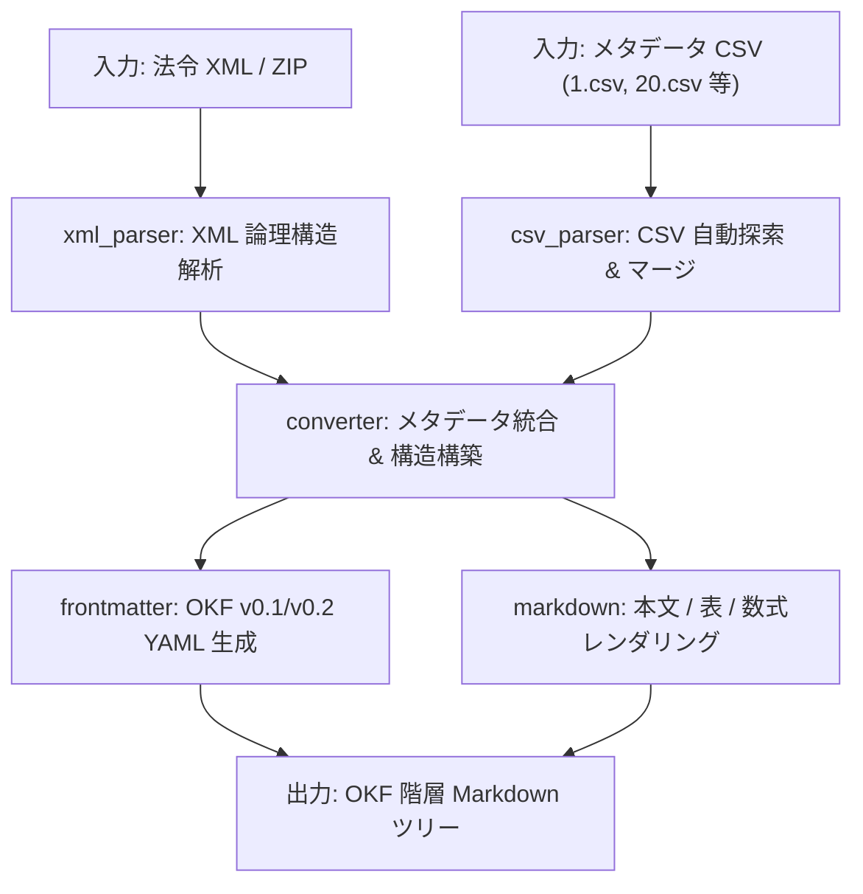

# 変換パイプライン アーキテクチャ

## 1. 概要

本システムのコアである `law2markdown` は、e-Gov 法令標準 XML スキーマ v3 に準拠した XML ファイル（および付随するメタデータ CSV）を入力とし、決定論的（Deterministic）かつ完全原本維持（ASIS）で OKF 準拠の Markdown ファイル群を出力するパイプラインを提供します。

## 2. パイプライン構成

## 3. コンポーネント役割

| モジュール | 役割 |
|---|---|
| `law2markdown.parser.xml_parser` | 法令 XML をパースし、条文・項・号・表・数式・附則・様式を中間モデル（`ParsedLaw`）に抽出 |
| `law2markdown.parser.csv_parser` | ZIP 内の複数 CSV（連番 CSV 含む）を探索し、公布日・施行日・カナ等のメタデータを抽出 |
| `law2markdown.renderer.frontmatter` | `LawMetadata` から OKF 準拠の YAML Frontmatter 文字列を生成 |
| `law2markdown.renderer.markdown` | 本文（ASIS）・パイプ表/HTML表・LaTeX数式・パンくずナビゲーションを生成 |
| `law2markdown.converter` | 全体オーケストレーション、出力ディレクトリ命名・衝突回避、最上位 `index.md` の一括生成 |
| `law2markdown.validator` | 出力ファイル群の相対リンク完全性検証（リンク切れ404の自動検出）および統計監査 |
| `law2markdown.cli` | コマンドラインインターフェース（`law2md convert`, `law2md convert-zip`）および監査レポート表示 |

## 4. 関連概念

* [法令 XML から OKF Markdown への変換仕様](../domain/law_converter.md) - 詳細な変換・マッピング規約
* [Wiki用 Markdown 出力詳細仕様書](../domain/wiki_markdown_spec.md) - 出力ツリー構造と命名規則
* [実行環境と CLI 仕様](../infrastructure/cli_and_env.md) - コマンドライン実行と環境定義
